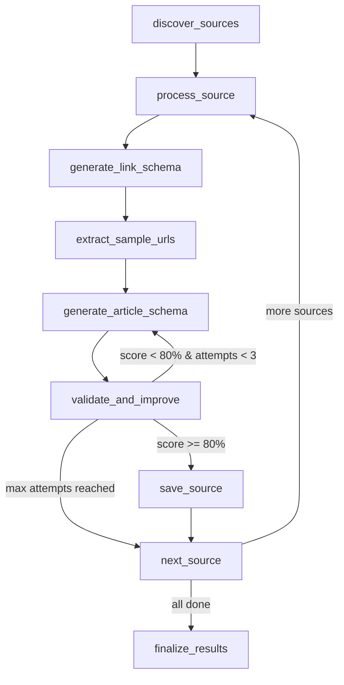

# 🚀 LangGraph Migration Guide

This document explains the migration from the original structured agent to the new LangGraph-based implementation with enhanced state management and validation feedback loops.

## ✨ What's New

### 🔄 **Enhanced State Management**
- **Persistent State**: Each source maintains detailed state across validation attempts
- **Validation Feedback**: Failed validations generate specific feedback for schema improvement
- **Retry Logic**: Automatic retries with targeted improvements based on validation results
- **Conditional Branching**: Smart decision-making based on validation scores and attempt counts

### 🎯 **Improved Validation Process**
- **Enhanced LLM Comparison**: Better prompts and scoring for validation comparisons
- **Specific Feedback Generation**: CSS selector suggestions based on what's missing
- **Feedback Integration**: Schema generation incorporates feedback from previous attempts
- **Iterative Improvement**: Each retry uses lessons from previous validation failures

### 🛡️ **Better Error Handling**
- **Graceful Failures**: Sources that fail don't block other sources
- **Detailed Error Tracking**: Each error is captured with context
- **Recovery Mechanisms**: Multiple retry strategies for different failure modes
- **Resource Cleanup**: Proper cleanup even when errors occur

## 📁 New Files

```
src/
├── langgraph_agent.py                    # New LangGraph-based agent
├── tools/
│   └── article_schema_generator_enhanced.py  # Enhanced schema generator with feedback
├── main_langgraph.py                     # New entry point for LangGraph agent  
└── test_langgraph_agent.py              # Test script for LangGraph agent
```

## 🚀 Quick Start

### Install Dependencies

```bash
# Install the new LangChain dependencies
pip install -r requirements.txt
```

The requirements.txt now includes:
- `langchain>=0.1.0`
- `langchain-community>=0.0.20` 
- `langgraph>=0.0.30`
- `langchain-google-genai>=1.0.0`

### Run the LangGraph Agent

```bash
# Using the new LangGraph entry point
python main_langgraph.py --query "AI research" --pretty

# Or test it first
python test_langgraph_agent.py
```

### Programmatic Usage

```python
import asyncio
from src.langgraph_agent import run_langgraph_agent

async def example():
    result = await run_langgraph_agent("AI technology news")
    
    for source in result["sources"]:
        print(f"Source: {source['name']}")
        print(f"Status: {source['status']}")
        print(f"Validation Score: {source.get('validation_score', 'N/A')}")
        print(f"Attempts: {source.get('validation_attempts', 1)}")
        
        if source.get('validation_feedback'):
            print("Feedback applied:")
            for feedback in source['validation_feedback']:
                print(f"  • {feedback}")

asyncio.run(example())
```

## 🔧 Architecture Overview

### LangGraph Workflow



### State Management

Each source maintains detailed state:

```python
{
    "name": "TechCrunch",
    "url": "https://techcrunch.com",
    "status": "completed",           # pending, processing, completed, failed
    "validation_score": 85.5,        # 0-100
    "validation_attempts": 2,        # Number of attempts made
    "validation_feedback": [         # Feedback from each failed attempt
        "Title extraction needs improvement - try h1.headline selector",
        "Content extraction incomplete - use broader .post-content p selector"
    ],
    "validation_details": {          # Detailed comparison results
        "comparisons": [...],
        "schema_extractions": [...],
        "ground_truth_extractions": [...]
    }
}
```

## 📊 Enhanced Validation Process

### 1. **Schema Generation with Feedback**
- Incorporates feedback from previous attempts
- Uses enhanced prompts that include specific improvement suggestions
- Focuses on addressing previously identified issues

### 2. **Enhanced LLM Comparison**
- More detailed scoring system (title: 25pts, content: 35pts, author: 15pts, date: 15pts, summary: 10pts)
- Specific feedback generation with CSS selector suggestions
- Context awareness of previous feedback to avoid repetition

### 3. **Smart Feedback Generation**
- Analyzes patterns across multiple URL comparisons
- Generates specific, actionable CSS selector improvements
- Prioritizes most impactful improvements first

## 🎯 Benefits Over Original Agent

| Aspect | Original Agent | LangGraph Agent |
|--------|---------------|-----------------|
| **State Management** | Manual tracking in dataclass | Persistent LangGraph state with automatic transitions |
| **Error Handling** | Basic try/catch | Graceful failures with detailed error tracking |
| **Validation Feedback** | None | Specific CSS selector improvements generated automatically |
| **Retry Logic** | Simple loop | Smart conditional branching based on validation results |
| **Schema Improvement** | Static prompts | Dynamic prompts incorporating previous feedback |
| **Observability** | Basic logging | Detailed state tracking and validation history |

## ⚙️ Configuration

### Validation Thresholds

```python
# In langgraph_agent.py - easily configurable
min_score_threshold = 80.0    # Minimum score to save to database
max_attempts = 3              # Maximum validation attempts per source
target_score = 90.0          # Target score for "excellent" schemas
```

### Feedback Categories

The enhanced validation generates feedback in these categories:
- **Title extraction**: Selector improvements for headlines
- **Content extraction**: Paragraph and main content selectors  
- **Author extraction**: Byline and author selectors
- **Date extraction**: Publication date selectors
- **Summary extraction**: Description and excerpt selectors

## 🧪 Testing

```bash
# Test the full LangGraph workflow
python test_langgraph_agent.py

# Test specific components
python -m pytest tests/ -v
```

## 🔄 Migration from Original Agent

### For Existing Code

The LangGraph agent maintains the same interface:

```python
# Old way (still works)
from structured_agent import run_structured_agent
result = await run_structured_agent(query)

# New way (enhanced)
from langgraph_agent import run_langgraph_agent  
result = await run_langgraph_agent(query)
```

### Key Differences

1. **Return Format**: Same structure, but with additional fields:
   - `validation_attempts`: Number of attempts made
   - `validation_feedback`: List of feedback applied
   - `enhanced_feedback`: Specific improvements suggested

2. **Processing**: More resilient to individual source failures

3. **Validation**: Much more sophisticated with iterative improvement

## 📈 Performance Considerations

- **Caching**: Ground truth extractions are cached to avoid redundant LLM calls
- **Parallel Processing**: Sources are still processed sequentially (as requested)
- **Resource Management**: Better cleanup and resource management
- **Rate Limiting**: Existing rate limiting is preserved

## 🚨 Troubleshooting

### Common Issues

1. **Import Errors**: Make sure LangChain dependencies are installed
2. **API Keys**: Ensure `GOOGLE_API_KEY` is set for enhanced validation
3. **Memory Usage**: LangGraph state can use more memory for complex workflows

### Debug Mode

```python
import logging
logging.getLogger('langgraph').setLevel(logging.DEBUG)
```

## 🎉 Next Steps

1. **Test** the LangGraph agent with your queries
2. **Compare** results with the original agent
3. **Adjust** validation thresholds if needed
4. **Monitor** feedback generation and schema improvements
5. **Migrate** your applications to use the new entry point

The LangGraph migration brings significantly better state management, validation feedback, and error handling while maintaining the same core functionality and interface.

Ready to get started? Run:

```bash
python test_langgraph_agent.py
``` 